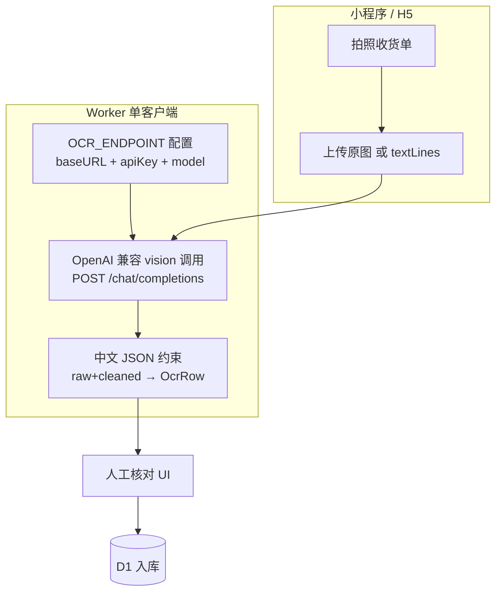

# OCR / 语音 AI 方案调研

## Report

**本轮产出** — 调研报告（含中文表格场景修订）：对比 Cloudflare Workers AI、微信小程序侧白嫖能力、国产中文 OCR 通道，给出中文优先的表格→JSON 方案与语音开单路径。**不改业务代码**。

**结论摘要（中文优先修订后）**

1. **中文收货单/表格 OCR 不要把 Cloudflare 当主路径。** Workers AI 无专用表格模型；`llama-3.2-11b-vision` 官方仅英语图像理解；`moondream3.1` 主打英文视觉推理，**中文未核实、不可假定可用**。Cloudflare 降级为：英文表格 / 结构极简表 / 最后保险。
2. **中文主场推荐链路：**
   - **P0 首选**：硅基流动 **PaddleOCR-VL-1.5**（百度文档 OCR 主场；OmniDocBench 94.5%；印章、跨页表格、中英混排）
   - **P0 免费并列**：智谱 **glm-5.3-flash**（现行旗舰多模态；旧 `glm-4.6v-flash` 官方目录仍列免费，以控制台为准）
   - **付费兜底**：智谱 **glm-ocr**（专用 `layout_parsing` 接口，**唯一非 OpenAI 形状**；默认不接，免费档不够再加）
3. **微信白嫖**仍是端侧 **VisionKit OCR**（免费中文文字行，无表格结构）→ 作预处理；云上无免费表格 OCR；小程序 AI 开发模式 beta 不可提审。
4. **中文表格 JSON 硬约束**（见 S2.2b）：列名保留中文原文、单位不换算、原值+规范化双字段、禁 markdown 围栏、合并单元格靠专用模型。
5. **语音开单**：`RecorderManager` → CF Whisper 或智谱 GLM-ASR → LLM 结构化草稿 → **UI 确认后落库**。
6. 产品原则不变：人工核对 UI 必留；全链路可先免费档跑通。
7. **实现不拆 N 个 provider**：主路径都是 OpenAI 兼容 chat + image_url，一个客户端 + 配置表即可。

**Verification** — 文档调研 + 官方模型页核对（glm-4.6v-flash 免费、glm-ocr 价格、VisionKit API、CF 定价）。硅基流动 PaddleOCR-VL 具体 model id / 额度以实现时控制台为准。

**Journey log**
- 第一版报告把 CF Workers AI 写成中文主线，经纠正：中文表格应国产文档 OCR 优先，CF 降旁路
- 智谱 `glm-4.6v-flash` 是**免费**视觉模型且官方推荐复杂表格场景；`glm-ocr` 是专用轻量 OCR（0.9B，SOTA 文档解析）
- CF 侧 `@cf/zai-org/glm-5.3-flash` 只是「CF 上的中文 vision 兜底」，不能替代 PaddleOCR-VL / 智谱官方 OCR 通道
- 微信 VisionKit 适合「抽字省钱」，合并表头还原仍要国产表格模型
- **实现不必写 N 个 provider**：硅基流动与智谱 chat 均为 OpenAI 兼容 `/chat/completions` + `image_url`，差异几乎只有 `baseURL` / `apiKey` / `model`；**一个客户端 + 配置表**即可。`glm-ocr` 走的是另一套 `layout_parsing` 接口，才是唯一特殊形状

## [S1] Problem

店铺管家已上线拍照识别收货单（`apps/api/src/adapters/ai.ts`），但：

1. **中文表格识别质量未实测**；当前默认 `gemma-4-26b` / `moondream3.1` 对中文表头、合并单元格、全角数字不可靠（HANDOVER 状态 🟡）。
2. 需评估**微信小程序免费 AI**能否补充；并明确 Cloudflare 在中文场景的定位。
3. 新增：**语音开单**与**语音操作管理功能**，同样尽量免费可落地。

## [S2] Design

### S2.1 现状契约（勿破坏）

```ts
// packages/shared
interface OcrRow {
  name: string
  spec: string | null
  qty: number
  unit: string | null
  unit_price: number | null   // 元
  amount: number | null       // 元
}
// POST /api/ocr/purchase  body: { image_key: string }
// → { rows: OcrRow[], model: string, raw: string }
```

前端 `purchase-new`：拍照 → 识别 → 可编辑表格 → 匹配商品/新建 → 入库。人工校对是产品原则。

### S2.2 中文表格→JSON：通道优先级（修订）

| 优先级 | 通道 | 中文/表格 | 费用 | 定位 |
|---|---|---|---|---|
| **P0-A** | 硅基流动 **PaddleOCR-VL-1.5** | 文档主场：生僻字、中英混排、印章、跨页表；OmniDocBench ≈94.5% | 以硅基流动控制台为准（通常有免费额度） | **中文主通道** |
| **P0-B** | 智谱 **glm-4.6v-flash** | 官方免费；复杂表格（多层表头/合并单元格/跨页）点名场景 | **免费** | **中文并列主通道 / 免费首选** |
| **P1** | 智谱 **glm-ocr** | 专用 OCR 0.9B；表格 HTML/结构化；OmniDocBench V1.5 ≈94.6 | ≈0.2 元/M tokens（约 ¥1≈2000 张 A4） | 付费高精度兜底 |
| **P2 旁路** | CF `@cf/zai-org/glm-5.3-flash` | CF 上相对中文友好的 vision | 10k neurons/天内 | 英文表 / 极简表 / 再保险 |
| **不推荐主路径** | CF gemma-4 / moondream3.1 / llama-3.2-11b-vision | 中文弱；llama-3.2 图像理解官方仅英语；moondream 中文未核实 | 免费额度内 | 仅英文或对照实验 |

**Cloudflare 定位修订**

- 保留现有 `AiAdapter` 作为「本地 binding 旁路」与英文场景 fallback，**不再作为中文收货单默认主路径**。
- 若继续用 CF 做中文：`OCR_MODEL=@cf/zai-org/glm-5.3-flash` 仅作 CF 内最优，仍弱于 PaddleOCR-VL / 智谱官方 OCR 产品线。

### S2.2b 中文表格 JSON 硬约束（Prompt / Schema）

实现时必须写进 prompt 与后处理，避免「能识别但字段漂移」：

1. **JSON key 保留中文原文**（`品名`/`数量`/`单价`/`金额`），不要翻译成 amount/total 混用；业务层再映射到 `OcrRow`。
2. **单位不换算**：`元`/`万元`、`kg`/`吨` 原样输出字符串；另字段 `unit_norm` / `price_norm` 由代码解析，禁止模型顺手换算。
3. **原值 + 清理值**：`raw` 保留全角括号、顿号、`¥`；`cleaned` 再做半角/去符号。
4. **禁 markdown 代码块**：prompt 明确「只输出 JSON，不要 ``` 围栏」；解析层仍做一次剥离保险。
5. **合并单元格**：不要指望通用 VLM 自己拼；优先 PaddleOCR-VL / glm-ocr / glm-4.6v-flash 的结构化输出。
6. **金额**：同时输出原始字符串与「分」整数（与现有 D1 金额单位一致），转换失败则 null 并人工核对。

建议 schema（业务映射前）：

```json
{
  "表格标题": "收货单",
  "表头": ["品名", "规格", "数量", "单位", "单价", "金额"],
  "行": [
    {
      "品名": {"raw": "红牛", "cleaned": "红牛"},
      "数量": {"raw": "２", "cleaned": "2", "value": 2},
      "单价": {"raw": "6.00元", "cleaned": "6.00", "value_fen": 600, "unit_raw": "元"},
      "金额": {"raw": "12.00", "cleaned": "12.00", "value_fen": 1200}
    }
  ],
  "备注": null
}
```

后处理再压成现有 `OcrRow[]`。

### S2.2c Cloudflare Workers AI（旁路能力备忘）

| 维度 | 结论 |
|---|---|
| 免费额度 | 10,000 Neurons/天 |
| 专用表格 OCR | 无 |
| 中文 vision 兜底 | `@cf/zai-org/glm-5.3-flash`（约 13636 neurons/M in） |
| 英文/通用 | gemma-4-26b；moondream3.1（英文 OCR 叙事，中文未核实） |
| 语音 ASR | `@cf/openai/whisper` ≈41 neurons/分钟 |

### S2.3 微信小程序 AI 能力（白嫖盘点）

| 能力 | 是否免费 | 能否表格→JSON | 匹配度 |
|---|---|---|---|
| **VisionKit OCR**（基础库 ≥2.27） | 是，端侧 | 否，仅文本 anchors | **高**：中文抽字预处理 |
| `createInferenceSession` ONNX | 是（自备模型） | 需自训 | 低 |
| 小程序 AI 开发模式 beta | 官方环境 | 非 OCR 通道；**不可提审** | 低 |
| 同声传译等语音插件 | 历史免费，需核实 | ASR 有、表格无 | 中：ASR 备选 |
| 扫一扫 | 是 | 仅码 | 已有 |

VisionKit 用法见前版；H5 无此能力，需平台分支。

### S2.4 语音开单 / 语音操作

与前版一致，补充 ASR 选择：

| 通道 | 中文 | 费用 | 建议 |
|---|---|---|---|
| CF Whisper | 好 | ~41 neurons/min | Worker 已有 binding，**默认** |
| 智谱 **GLM-ASR-2512** | 高精度中文/方言 | 智谱计费 | 若主路径已用智谱 key，可作中文优选 |
| 同声传译插件 | 中上 | 需核实 | 小程序备选 |

开单草稿仍走：ASR 文本 → LLM JSON → UI 确认 → 现有 `POST /api/orders`。

### S2.5 推荐架构（中文优先）



**接口形态核对（为何只需一个客户端）**

| 通道 | 接口 | 是否 OpenAI 兼容 |
|---|---|---|
| 硅基流动 PaddleOCR-VL / VLM | `POST https://api.siliconflow.cn/v1/chat/completions`，`image_url` | **是** |
| 智谱 glm-4.6v-flash | `POST https://open.bigmodel.cn/api/paas/v4/chat/completions`，`image_url` | **是**（OpenAI SDK 可直连） |
| 智谱 glm-ocr | `POST .../v4/layout_parsing` | **否**（专用布局解析；默认不接） |
| CF Workers AI | `env.AI.run(model, {messages, image})` binding | 形状不同；Worker 内可保留现有 adapter 作旁路 |

**实现形状（仍不写代码，仅约定）**

```ts
// 一份配置，不写多个 provider 文件
type OcrEndpoint = {
  baseURL: string   // 硅基流动 / 智谱
  apiKey: string
  model: string     // 如 PaddleOCR-VL 或 glm-4.6v-flash
}
// 同一套 prompt + image_url content + extractJson + 映射 OcrRow
// fallback 链 = 多条 OcrEndpoint 配置，不是多套适配器
```

**落地阶段**

- **P0**：一个 OpenAI 兼容 vision 调用 + S2.2b schema/prompt；配置两条 endpoint（Paddle / glm-4.6v-flash）；无 Key 时 mock。真实单据 A/B 只换 `model`/`baseURL`。
- **P1**：可选接 `glm-ocr` 的 `layout_parsing`（唯一需要单独写的形状）；VisionKit 抽字。
- **P2**：语音。

### S2.6 明确不采纳

- 以 CF gemma/moondream/llama 作为中文表格主路径。
- 微信 AI 开发模式进生产。
- 取消人工核对全自动入库。
- 模型侧做单位换算或翻译列名。

## [S3] Out of Scope

- 本轮不改业务代码、不部署（脚本若另开实现轮再写）。
- 不做多门店、离线 OCR、增值税专票全链路。

## Tasks

- [x] T1: 梳理现有 OCR 契约与模型链路（covers: S2.1）
- [x] T2: 调研 CF Workers AI 目录/价格/中文能力（covers: S2.2c）
- [x] T3: 调研微信小程序 OCR/语音/插件边界（covers: S2.3）
- [x] T4: 设计语音开单草稿契约（covers: S2.4）
- [x] T5: 给出分阶段架构与参考资料（covers: S2.5）
- [x] T6: **修订**中文优先通道（PaddleOCR-VL / glm-4.6v-flash / glm-ocr；CF 降旁路）与 JSON 硬约束（covers: S2.2, S2.2b）
- [ ] T7: P0 单 OpenAI 兼容客户端 + 配置化 endpoint + schema 约束 + 真实单据 A/B — acceptance: 只换 baseURL/model 即可对比；记录准确率（covers: S2.2, S2.2b, S2.5）
- [ ] T8: P1 VisionKit 抽字扩展 `/api/ocr/purchase` — acceptance: 同单路径 neurons/费用更低且中文可核对（covers: S2.3, S2.5）
- [ ] T9: P2 语音转写 + 开单草稿 — acceptance: 真机说话生成可编辑草稿，确认后落库（covers: S2.4, S2.5）

## 参考资料

### 国产中文 OCR（主路径）

- 智谱 GLM-4.6V-Flash（免费视觉/复杂表格）：https://docs.bigmodel.cn/cn/guide/models/free/glm-4.6v-flash
- 智谱 GLM-OCR（专用 OCR，0.2 元/M tokens）：https://docs.bigmodel.cn/cn/guide/models/vlm/glm-ocr
- 智谱模型概览：https://docs.bigmodel.cn/cn/guide/start/model-overview
- 智谱价格页：https://open.bigmodel.cn/pricing
- 智谱 GLM-ASR / 语音：https://docs.bigmodel.cn/cn/guide/models/sound-and-video/glm-asr-2512
- 硅基流动（托管 PaddleOCR-VL 等）：https://cloud.siliconflow.cn/ · 文档 https://docs.siliconflow.cn/
- PaddleOCR-VL-1.5：百度文档 OCR 方向；实现时以硅基流动模型列表中的准确 model id 与定价为准

### Cloudflare（旁路）

- Models：https://developers.cloudflare.com/workers-ai/models/
- Pricing：https://developers.cloudflare.com/workers-ai/platform/pricing/
- glm-5.3-flash：https://developers.cloudflare.com/workers-ai/models/glm-5.3-flash/
- whisper：https://developers.cloudflare.com/workers-ai/models/whisper/

### 微信小程序

- VisionKit OCR：https://developers.weixin.qq.com/miniprogram/dev/framework/open-ability/visionkit/ocr.html
- AI 推理：https://developers.weixin.qq.com/miniprogram/dev/framework/open-ability/inference/tutorial.html
- AI 开发模式 beta：https://developers.weixin.qq.com/miniprogram/dev/ai/guide
- RecorderManager：https://developers.weixin.qq.com/miniprogram/dev/api/media/recorder/RecorderManager.html

### 对照

- 百度 OCR 免费测试资源：https://cloud.baidu.com/doc/OCR/s/fk3h7xu7h
- 百度表格文字识别 V2：https://cloud.baidu.com/doc/OCR/s/Al1zvpylt

### 本仓库

- `apps/api/src/adapters/ai.ts` · `apps/api/src/routes/ocr.ts`
- `apps/miniapp/src/pages/purchase-new/index.tsx`
- `packages/shared/src/types.ts` — `OcrRow`
- `HANDOVER.md` §2.3
